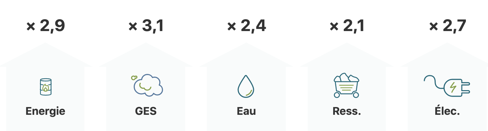
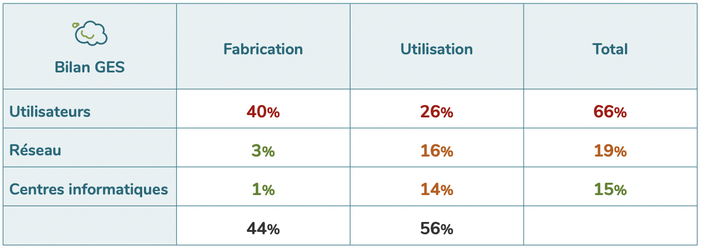
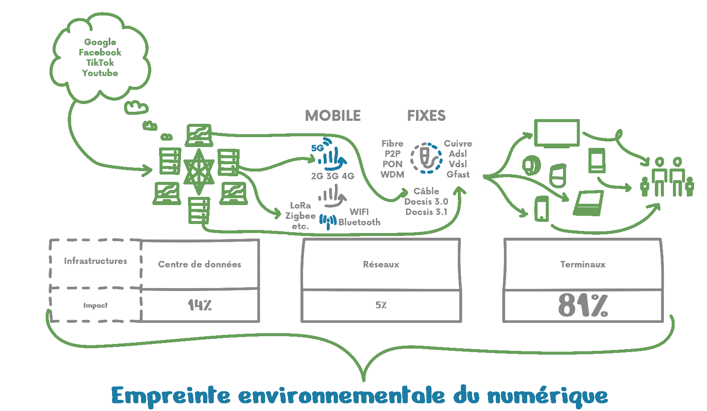
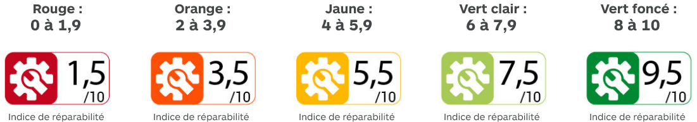

Le numérique envahit de plus en plus notre quotidien, il est présent quasiment partout. On est souvent loin d’imaginer son empreinte sur l’environnement, pour la simple et bonne raison que contrairement à un véhicule par exemple, il n’émet pas directement de gaz à effet de serre. Pourtant, la production de milliards de smartphones et l’échange de quantités massives de données contribuent de manière bien réelle au réchauffement climatique.

Le numérique représente entre 3% et 4% des émissions de gaz à effet de serre à l’échelle mondiale, et ce chiffre pourrait doubler d’ici quelques années. Focus sur l'impact du numérique sur l’environnement, ou pollution numérique, et les moyens mis à notre disposition pour réduire son empreinte carbone, aussi appelés GreenIT.

‍

## 1. Quel est l’impact environnemental du digital ? D’où vient la pollution numérique ?
‍

Des minerais nécessaires à la production de nos smartphones jusqu’à l’énergie utilisée pour alimenter les batteries, en passant par l’utilisation massive d’eau pour refroidir les data centers, le numérique a d’énormes impacts environnementaux, que l’on est parfois loin d’imaginer.

Le principal impact provient des pollutions et dérèglements engendrés par les émissions de gaz à effet de serre (GES) que le secteur du numérique émet. Ces émissions sont assez facilement quantifiables - environ 1 400 millions de tonnes de GES en 2019 - et sont en grande partie liées à la production d’énergie nécessaire à la fabrication des équipements et à leur utilisation.

Tous les indicateurs environnementaux de la pollution du numérique devraient doubler ou tripler entre 2010 et 2025.

‍

### 1.1 Comment le numérique impacte les ressources naturelles ?
‍

La consommation du numérique en métaux et métaux rares représente la partie cachée de l’iceberg. Malgré l’image immatérielle que l’on en a, le numérique alimente sa croissance exponentielle grâce à l’exploitation intensive de métaux (cuivre, tantale, gallium, or, platine, etc.). Bien que consommés en très faibles quantités, ces métaux sont devenus indispensables, par leurs caractéristiques exceptionnelles, pour améliorer les performances de nos équipements.

Le problème ? La forte hausse de la demande mondiale en métaux rares contribue à leur exploitation non durable et donc à leur épuisement. En 2015, la production de cuivre était 5 fois plus élevée qu’en 1960 (tandis que la population mondiale avait “seulement” doublé sur cette période !). L’US Geological Survey estime que les réserves d’antimoine, d’étain et de chrome seraient inférieures à 17 années de rythme de consommation constant.

De plus, l’extraction et le raffinage de ces terres rares nécessitent de l’énergie, ainsi qu’une quantité importante d’eau. Elles contribuent donc à l’augmentation des émissions de GES, ainsi qu’à une pression augmentée sur les ressources en eau dans les pays d’origine.

Un ordinateur de 2 kg par exemple nécessite 500 kg de matières premières pour sa production, et la fabrication d’un smartphone nécessite plus de 70 matériaux différents, dont une cinquantaine de métaux rares. Pas si intangible que ça finalement l’empreinte écologique du numérique…

‍

### 1.2 Quid de l’impact des déchets électroniques ?
‍

À l’autre bout de la chaîne, ces équipements numériques produisent une quantité importante de déchets dangereux et polluants. Au niveau mondial, seulement 20% des déchets numériques, tous équipements confondus, sont collectés ! Le Programme des Nations unies pour l'environnement (PNUE) estime que, des 50 millions de tonnes de déchets électroniques produites chaque année, seulement 10 % sont recyclés.

De plus, un rapport de L’ONU évaluait qu’environ 75% des déchets électroniques échappent aux filières légales de recyclage ! La majorité de ces déchets sont mis en décharge, brûlés ou font l'objet d'un commerce illégal et d'un traitement non conforme aux normes.

Les motivations sont nombreuses : éviter le coût du recyclage légal, recevoir des paiements pour les équipements usagés… Pour ceux qui sont exportés illégalement, ils finissent leur vie en Chine, en Inde ou en Afrique dans des immenses décharges à ciel ouvert, comme celle au Nigeria ci-dessous.

Et pour les déchets qui parviennent jusqu’aux filières de recyclage, leur design empêche de récupérer les matières premières. De nombreux métaux des technologies numériques (gallium, germanium, indium, tantale, terres rares) ne sont presque pas recyclés.

‍

### 1.3 Le numérique et le climat, green cloud ou nuage noir ?
‍

En 2019, les émissions de gaz à effet de serre du numérique mondial représentaient l’équivalent d’un 7ème continent de la taille de 2 à 3 fois la France. En France aujourd’hui, le numérique représente 2% des émissions de gaz à effet de serre, avec une augmentation de + 60 % prévue d’ici 2040 si rien n’est fait pour réduire son impact.

Les émissions de gaz à effet de serre devraient être multipliées par trois entre 2010 et 2025, principalement à cause des facteurs suivants :

Les pays émergents utilisant des énergies plus carbonées (comme le charbon ou le pétrole) prennent le relais des pays développés
Les progrès en matière d’efficience énergétique ralentissent
Les ventes de nouveaux équipements connectées (IoT) s’accélèrent
‍
L’empreinte environnementale du numérique comprend tout un écosystème complexe et surtout mondialisé associant opérateurs de communications, centres de données, fabricants d’équipements, fournisseurs de services, etc. ; chacun recourant également à une chaîne de fournisseurs et de sous-traitants. Et cet écosystème n’opère pas seulement en France : les Français accèdent aux différents services et contenus via des centres de données parfois situés à l’étranger et les équipements sont souvent produits dans des pays à l’énergie plus carbonée (ayant une haute utilisation d’énergie non-renouvelable) qu’en France.

‍

## 2. D’où provient la pollution carbone du numérique ?
‍

L'infographie ci-dessous montre la division du bilan carbone mondial du numérique. On remarque que la plus grande partie de l’empreinte provient des équipements - smartphones, ordinateurs, écrans - utilisés par les consommateurs.

En France, la part des émissions associées aux terminaux est encore plus importante, avec plus de 80% de l’empreinte environnementale du numérique engendré par eux !

Il est important de bien connaître les ordres de grandeur afin de comprendre les déterminants de l’empreinte du numérique, et donc savoir quoi changer pour la réduire.

‍

## 2.1 L’impact CO2 des équipements électroniques
‍

Prenons comme exemple un ordinateur portable. Sa production en Chine, pays à l’énergie fortement carbonée, émet environ 890 kg CO2e. Pour ce qui est de son utilisation, un calcul relativement simple permet de déterminer les émissions qu’elle génère. En France un kilowatt heure engendre environ 60 g CO2e et la consommation d’un ordinateur portable allumé 8 heures par jour est d’environ 300 kWh sur une année.

La phase d’utilisation d’un ordinateur portable génère donc 18 kg CO2e par an (l’équivalent de 93 kilomètres parcourus en voiture), soit environ 50 fois moins que sa phase de production. Attention toutefois, ce chiffre ne prend en compte que les émissions liées à l’alimentation électrique de l’ordinateur, et non pas les émissions liées à sa connexion au réseau.

Selon l’association Green IT, le secteur numérique mondial était constitué en 2019 de 34 milliards d’équipements, pour 4,1 milliards d’utilisateurs, soit une moyenne de 8 équipements par utilisateur. Ça vous parait beaucoup ? Pensez-y : un ordinateur perso, un ordinateur pro, un portable (ou deux), une télévision, une tablette, une box internet, etc. On n’est pas si loin du compte finalement, non ?

Ce chiffre devrait augmenter dans les années à venir, dopé par l’émergence de l’internet des objets et l’arrivée massive de milliards d’objets connectés en tout genre.

L’Internet des Objets (IoT) : économies d’énergie ou bombe carbone ?

L'internet des objets - ou Internet of Things - décrit le réseau d'objets physiques équipés de capteurs, de logiciels et d'autres technologies dans le but de se connecter et d'échanger des données avec d'autres appareils et systèmes via l'internet. Mais attention : est-ce que la production de ces objets et leur connexion permanente au réseau vont émettre plus de CO2 et économiser plus de ressources que les économies réalisées grâce à leur utilisation ? Personne n’est capable de répondre pour l’instant.

L’Agence Internationale de l'Énergie (AIE) prévoit 46 milliards d’objets connectés d’ici 2030 et préconise une étude approfondie des impacts environnementaux et de la pollution numérique associée avant l’adoption généralisée des objets connectés, au vu de leur bilan carbone potentiellement très élevé.

‍

## 2.2 La pollution digitale liée au réseau
‍

Les réseaux représentent l’un des maillons essentiels du numérique. L’augmentation constante des communications électroniques et des échanges de données font peser une importance croissante sur ces réseaux, et donc la pollution numérique associée.

La consommation énergétique des réseaux représente une part importante de leurs coûts d’exploitation (de l’ordre de 15 à 20%). Dans les pays où l’électricité est très carbonée, cette consommation énergétique représente aussi une part importante des émissions de gaz à effet de serre des réseaux.

Une part importante de l’empreinte carbone des réseaux provient des technologies nécessaires à leur diffusion. Il existe plusieurs technologies de connexion au réseau comme le cuivre (ADSL et VDSL), le câble, la fibre optique, et le réseau cellulaire. Ces différentes technologies n’ont pas toutes la même consommation d’électricité ni le même bilan carbone : un utilisateur de réseau 4G consommerait de l’ordre de 50 kWh d’électricité, contre 16 kWh pour de l’ADSL et 5 kWh pour une ligne fibre optique.

‍

## 2.3 Le bilan carbone des data centers
‍

Pour permettre le stockage de volumes colossaux de données dématérialisées, les data centers ont poussé comme des champignons à travers le monde entier. Ces centres regroupent l’ensemble des installations au sein desquelles sont stockées et traitées les données informatiques grâce à des rangées d’ordinateurs et d’espaces de stockage.

Le Data Center Map recense aujourd’hui plus de 4 000 centres dans le monde, dont quasiment la moitié aux États-Unis. Ces centres ont une consommation énergétique colossale, nécessaire à leur fonctionnement et à leur refroidissement. 3% de l’électricité mondiale est destinée à leur alimentation, et ce chiffre pourrait atteindre 13% en 2030.

‍

## 2.4 Verdict : Le numérique pollue, et la tendance est à l'accélération
‍

L’augmentation des échanges de données liée à la mise en réseau de milliards d’objets connectés, ainsi que la généralisation du recours à la vidéo en haute définition, contribuent massivement à faire croître les échanges de données dématérialisées. Nous sommes entrés depuis 2016 dans l’ère du zettabyte, avec plus de 1 000 milliards de bytes (unité de stockage numérique) échangés.

Vidéos et streaming : gourmands en données

L’utilisation croissante de la vidéo haute définition contribue tout particulièrement à l’augmentation de l’empreinte carbone du numérique. Le visionnage de vidéos en ligne a généré en 2018 plus de 300 MtCO2e, soit l’équivalent des émissions de gaz à effet de serre de l’Espagne (The Shift Project). Et les formats de vidéo en ultra haute définition (UHD) requièrent des débits 9 fois plus élevés que les formats standards (SD).

Ralentissement du taux d’augmentation de l’efficacité énergétique

Jusqu’à peu, une partie de l’augmentation des échanges de données était balancée par les progrès en matière d’efficacité énergétique. Depuis 2018, ces progrès ralentissent : l’intensité énergétique (mesure de l'efficacité énergétique) s’est améliorée de seulement 1,2% en 2018, chiffre le plus faible de la décennie. L’AIE a récemment alerté sur ce ralentissement, craignant une explosion de la consommation d’électricité liée à la croissance du numérique.

Dans le contexte actuel, alors que notre consommation d’énergie ne cesse de croître, l’International Energy Agency (IEA), au travers de Faith Birol, son directeur exécutif, rappelle qu’il n'y a “pas de chemin plausible vers le Net Zero Emissions sans utiliser nos ressources énergétiques de manière plus efficace".

Les pays émergents, utilisant beaucoup plus d’énergies fortement carbonées, prennent le relais des pays développés en matière de déploiement du numérique. Les classes moyennes ont de plus en plus accès aux nouvelles technologies, contribuant ainsi de manière exacerbée à la croissance de l’empreinte environnementale du numérique.

‍

# 3. Réduire l’impact environnemental du numérique : Green IT et sobriété numérique
‍

Le numérique responsable - ou GreenIT - représente l’ensemble des technologies et pratiques qui aident l’humanité à atteindre les objectifs du développement durable.

Au  niveau de l’entreprise, c’est la capacité à appliquer des critères de durabilité environnementale (tels que la prévention de la pollution, l'éco-conception des produits, l'utilisation de technologies propres) sur leurs équipements et leur consommation de numérique!

‍

## 3.1 Quelles mesures prendre avec nos équipements ?
‍

Comme nous l’avons expliqué précédemment, la phase de production des équipements électroniques est celle qui consomme le plus de ressources et qui émet le plus de gaz à effet de serre. Il faut environ 500 kg de matières pour produire un ordinateur portable, soit 250 fois son poids final !

Augmenter la durée de vie de nos appareils

Alors qu’un réel découplage entre la quantité de matériaux utilisée et la capacité technologique des appareils électroniques paraît difficilement atteignable, la solution la plus efficace consiste à réduire  la consommation de ces appareils.

Les phénomènes de mode et l’évolution rapide des technologies nous poussent à changer d’équipements de manière bien trop récurrente : la plupart de nos appareils sont encore en état de marche lorsque nous les changeons. 88% des Français changent leur téléphone portable alors qu’il fonctionne encore ! Allonger la durée de vie de nos équipements constitue une partie de la solution.

Certaines marques proposent toutefois des smartphones dont les modules - appareil photo, écran, batterie - peuvent être changés et mis à jour sans avoir à changer de téléphone: c’est une mesure positive pour l’environnement.

Une autre solution consiste à acheter les appareils électroniques les moins puissants et les plus sobres possible. La mutualisation de certains de ces objets - box internet, modems, etc. -, ainsi qu’un allongement de la durée de garantie légale, aujourd’hui fixée à 2 ans, permettrait de réduire leur empreinte.

L’indice de réparabilité fait depuis peu son apparition dans le quotidien des consommateurs français. Cette note, devenue obligatoire pour certaines catégories de produits (lave-linge à hublot, smartphone, ordinateur portable, téléviseur et tondeuse à gazon électrique), vise à sensibiliser les consommateurs à la réparation du produit dès son achat en l’informant du potentiel de réparabilité de ses appareils.

Cet indice prend en compte plusieurs critères comme la démontabilité du produit, la disponibilité des conseils d’utilisation et d’entretien ou encore la disponibilité et les prix des pièces détachées. Un excellent moyen de prolonger la vie des objets du quotidien et d’éviter l’achat de produits neufs !

‍

## 3.2 Ne pas oublier les réseaux et data centers !
‍

Au vu des évolutions des dernières décennies, l’existence des data centers ne peut visiblement pas être remise en cause. En revanche, il existe des moyens de réduire leur consommation d’énergie pour réduire leurs émissions de gaz à effet de serre. De plus en plus de clients prennent en compte le critère de développement durable dans le choix de leur centre de données. D’autant que le potentiel d’efficacité énergétique des data centers est très élevé.

*Optimiser les data centers !*

D’importants progrès en matière de refroidissement ont ainsi été réalisés ces dernières années, permettant d’optimiser la consommation énergétique des data centers. Les opérateurs font de plus en plus appel à la technique du “free cooling” qui consiste à utiliser l’air extérieur pour refroidir les centres afin de limiter le recours à la climatisation artificielle. Facebook a par exemple ouvert un data center proche du cercle polaire en Suède où les températures moyennes sont relativement faibles.

Il est aussi possible d’envisager une température plus haute à l’intérieur des data centers, la température recommandée étant aujourd’hui de 27°C, contre 24°C en 2004. Certains centres peuvent même atteindre des maximales de 45°C. Cette augmentation de la température permet de diminuer les besoins en climatisation et donc en énergie. La chaleur produite par ces data centers peut aussi être utilisée pour le chauffage de bâtiments. C’est le cas d’Air France qui chauffe 8 500 m2 de bureau grâce à la chaleur émise par un data center.

Enfin, de nombreuses entreprises du numérique se sont engagées à alimenter leurs data centers en énergies renouvelables. C’est le cas d’Amazon ou de Google, qui promettent une alimentation 100% renouvelable de leurs data centers d’ici une dizaine d’années. Aujourd’hui, les data centers sont encore majoritairement situés dans des pays aux mix énergétiques fortement carbonés, tels que les États-Unis, l’Allemagne et la Chine.

La mise en place d’hyper data centers en France permettrait d’améliorer la performance énergétique des centres de données. Ces très grands centres sont aujourd’hui implantés à l’étranger, et consomment une électricité en moyenne 10 fois plus carbonée que l’électricité française. L’installation de ce type de centres en France permettrait en outre de limiter les risques de saturation des réseaux à l’étranger et d’héberger les services au plus près des utilisateurs afin de limiter la latence.

*Mieux utiliser et moins consommer*

À y réfléchir, a-t-on vraiment besoin d’un forfait avec 100 gigas d’internet pour aller sur les réseaux sociaux et écouter de la musique en streaming ? Pas vraiment. Réguler l’offre des forfaits téléphoniques paraît une solution efficace pour maîtriser l’empreinte numérique de la 4G - et bientôt de la 5G - dans un monde aux ressources finies.

En ce qui concerne la vidéo, qui représente une part énorme de l’empreinte du numérique (utilisant 80% des données du web), on pourrait envisager l’instauration d’une taxe pour les plus gros émetteurs, tels que Netflix ou Youtube, qui mobilisent à eux deux un tiers de la bande passante.

En outre, il est nécessaire d’améliorer l’écoconception des sites et des services numériques. Cela veut dire, intégrer la réduction des impacts environnementaux dès la phase de conception, sans perdre la qualité du service. À terme, cette écoconception devrait être rendue obligatoire pour les grandes entreprises et les organismes publics. Pour réaliser un audit vert de votre site web, vous pouvez utiliser des outils tels qu’Ecoindex ou Ecometer. En ce qui concerne les bonnes pratiques à adopter, le livre de Frédéric Bordage fait référence en la matière. Il propose 115 pratiques à mettre en place pour doper son site web et réduire son empreinte écologique.

La sobriété énergétique, concept visant à faire baisser la consommation énergétique par le comportement des consommateurs, passe aussi par la mutualisation et la mise en veille systématique des box internet dans les maisons, les habitats collectifs et les entreprises. Opquast fournit une liste de 72 mesures destinées à réduire votre empreinte numérique.

La lowtech numérique désigne les technologies numériques qui reposent sur des techniques largement diffusées, éprouvées, maîtrisées (simples à utiliser, fabriquer et à réparer), et qui nécessitent peu de ressources pour être fabriquées. Elle permet de répondre à la majorité des besoins quotidiens, tout en recourant à des technologies robustes, simples et ayant un impact environnemental limité. La 2G (une ancienne génération de téléphonie mobile) et les SMS font partie de ces solutions. Cela passe aussi par l’écoconception et la mise en place de designs minimalistes sur les sites internet les plus utilisés (le poids des pages Web a été multiplié par 115 entre 1995 et 2015).

Le numérique représente aujourd’hui entre 3% et 4% des émissions mondiales de gaz à effet de serre, et ce chiffre devrait doubler d’ici quelques années si rien n’est fait. Il est urgent de commencer à réfléchir aux solutions à mettre en place pour réduire notre empreinte liée au numérique. Chez Sami, on a déjà quelques idées pour vous et votre entreprise ! On prend rendez-vous pour en parler ? Il est temps d’agir !
